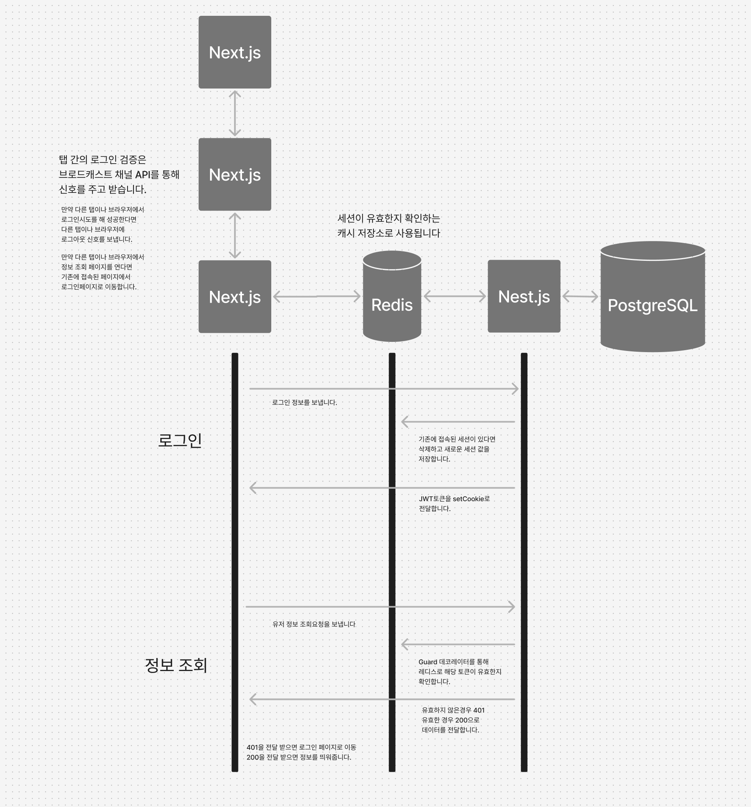

# simultaneouslogin

# 동시 로그인을 방지하기 위한 기능 테스트 레포지토리입니다.

## 테스트 환경

- NextJS@15(:3001)
- NestJS@10(:3000)
- Prisma
- Redis(:6379)
- PostgreSQL(:5432) (id: root, password: 1234)

## 테스트 방법

### 서버 실행

각 DB는 상기 명시된 포트로 열어주세요.

```
cd server
pnpm i
npx prisma migrate dev
pnpm run start:dev
```

### 클라이언트 실행

```
cd client
pnpm i
pnpm run dev
```

### 로그인 테스트

1. 두 개의 탭(localhost:3001)을 열고 각각 로그인을 시도합니다.
2. 두 번째 탭에서 로그인을 시도하면 첫 번째 탭에서 로그아웃 메시지가 오게 됩니다.
3. 첫 번째 탭에서 로그아웃 메시지를 받으면 두 번째 탭에서 로그아웃 메시지를 받게 됩니다.

### 다중 주소 접속 테스트

1. 두 개의 탭(localhost:3000)을 열고 각각 페이지에 접근을 시도합니다.
2. 기존에 열려있는 탭이 있다면 새로운 탭에서는 접속이 되어있다는 메세지가 발생하고 로그인 화면으로 넘어갑니다.

## 구조도



### 고려한 방식과 적용한 기술의 이유

첫번째로, 서버로부터 클라이언트로 중복로그인을 검증하는 방식은 4가지로 고려했습니다.

1. WebSocket을 사용하는 방식
2. SSE를 사용하는 방식
3. FCM을 사용하는 방식
4. 인증이 필요한 요청에 토큰을 검증하는 방식

이 중 WebSocket과 SSE는 서버와 클라이언트가 연결되서 서버의 부담이 커질것 같아 제외했습니다.

FCM은 클라이언트에서 알림 권한을 설정하지 않는다면 서버로부터 메세지를 받을 수 없어 제외했습니다.

따라서 최종적으로 인증이 필요한 요청에 토큰을 검증하는 방식을 채택했습니다.

두번째로, 최신 세션 값을 어떻게 관리하는지가 문제였습니다.
1. RDB의 유저테이블에서 최신세션을 업데이트 하는 방식
2. Nest.js 서버에서 캐시 메모리를 이용해서 최신세션을 관리하는 방식
3. Redis를 이용해서 최신세션을 관리하는 방식

1번의 경우 로그인 요청은 상당히 많을 것으로 예상, 빈번한 업데이트는 데이터베이스에 부하가 많이 될 것 같아 제외했습니다.

2번의 경우 서버가 재시작되면 캐시 메모리가 초기화되어 최신세션이 사라질 것, 또한 서버의 용량을 관리하는데 문제가 생길 것 같아 제외했습니다.

3번의 경우 데이터베이스와 캐시 메모리를 모두 사용하는 방식이라 최신세션을 관리하기 좋아 채택했습니다.

따라서 Nest.js에서 CacheManager를 이용해 레디스를 캐시 매니저로 이용하였고, 키를 유저의 아이디, 값을 JWT 토큰으로 설정하였습니다.